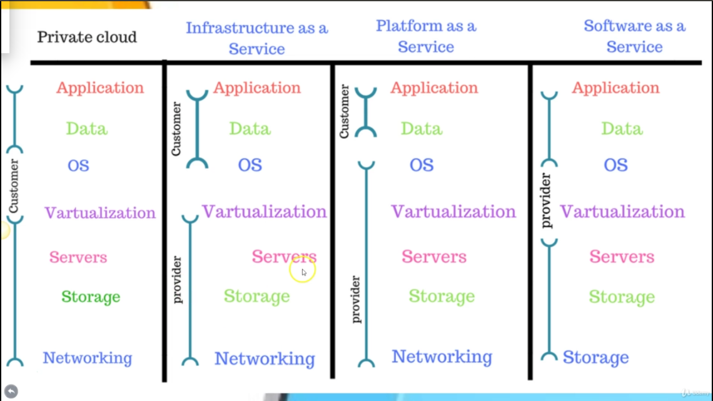
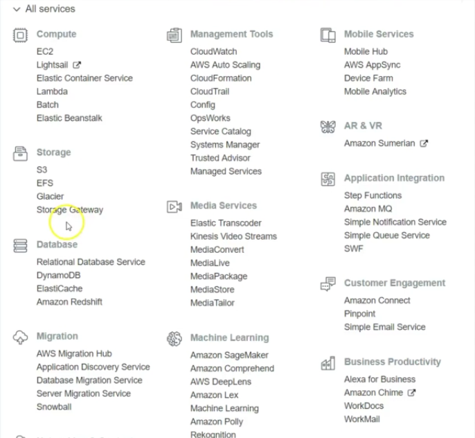

# AWS Certified Solution Architect Prep Material

### What is cloud computing

- Cloud computing is an architecture where computing resources are delivered over the
network to the user. 
- Businesses uses cloud computing to start their operation quickly without investing 
months to setup an IT infrastructure or data center.

### IAAS, PAAS and SAAS

 - *Infrastruture As A Service* : IaaS allows users to rent the infrastructure itself: servers, data center space, and software. The biggest advantage of renting, as opposed to owning, infrastructure is that users can scale up the amount of space needed at any time. During busy holiday seasons, online retailers may require more server space to handle the heavy traffic than in the off-season. Using IaaS allows the retailer to save money by only paying for what they will use within a certain time frame.

 - *Platform As A Service* : PaaS allows developers to create applications, collaborate on projects, and test application functionality without having to purchase or maintain infrastructure. Development platforms can be accessed as long as there is an internet connection, allowing team members to stay connected and keep working.

 - *Software As A Service* : When a company wanted to purchase new software in the past, it could be a very expensive and time consuming process. But with SaaS, software can be quickly deployed,since it is already installed on the cloud server. As with PaaS, users only need access to a computer with internet connection to use the software, and they never have to worry about upgrading or patching the software. SaaS can reduce costs, since users only pay for exactly what is needed and do not have to maintain the software.

 ### Public cloud, Private Cloud and Hybrid Cloud

 - *Public Cloud* : 
     - In public cloud, resources like servers and data centres and managed by third party        service providers. AWS, Azure are examples of public cloud.
     - In a public cloud, same hardware, storage and network devices are shared by                organizations using the cloud
     - low cost, no maintenance, unlimited scalability via on demand facility, high reliability

- *Private Cloud* : 
     - Private cloud consists of resources that are used by one business or organization          exclusively
     - They can be hosted physically at organization's data center or by a third party.
     - Hardware, software and infrastructure is completely dedicated to the organization needs
     - Used by government agencies, financial institutions and large corporations.
     - more flexibility, improved security and high scalability

- *Hybrid Cloud* :
     - It combines best features of both private and public cloud
     - In hybrid cloud, data and applications can move between private and public clouds
     - For example, using public cloud for high traffic, lower security apps such as web based
       email and using private cloud for sensitive, business critical operations like financial
       operations.
     - Cloud bursting, it means when high traffic is expected then the private cloud can use      more resources from the public cloud to handle the high volume.
     - control, cost-effectiveness, ease of transitioning to cloud

 
### Cloud Types

### Advantages of Cloud
- Low cost
- Easily upgrade
- Always up and running
- Disaster and Recovery management
- No IT maintenanace cost
- Offsite data storage
- Access from anywhere

### Disadvantages of Cloud
- Without internet, you cannot access your servers and data
- Securtiy and Privacy issues, like storing confidential information on cloud
- Vendor Lockin
- Limited Control

## Introduction to AWS
- Amazon Web Services launched in 2006, to provide computing resources to businesses in the form
  of web services.

- As of Sept-2018, AWS provides various services ranging from Compute, Mobile, Machine Learning   ... and many others services.

- Services Provided By AWS

